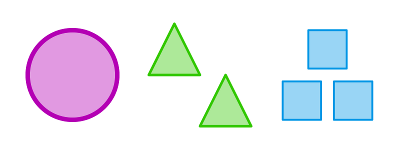

# CombiGame
CombiGame is a mobile app, web game and card game. Try it:

- [online](/solsort/combigame) (runs in a web browser)
    - [android version](https://play.google.com/store/apps/details?id=com.solsort.combigame)
- as a cardgame
    - [buy it online from TheGameCrafter](https://www.thegamecrafter.com/games/combigame)
    - catch me in person ;) and try it or buy it (DKK 120)

Game objectives: spot combinations of three figures where color, count, shape and fill, are either the same or all different.

For example the figures in:

are a valid combination, as they have different color, count and shape, and the same fill,
whereas:

are invalid as the color is neither all different or the same.

The card game goes as follows:

- put 12 cards on table face up
- when a player spots a valid combination, she tap on the table to indicate that she spotted it first, and the collect the combination
- when no valid combinations can be spotted, deal 3 more cards from the deck face up
- when all of the deck is dealt, and no more combinations can be spotted, the player who collected most combinations won.

When played on a phone/tablet/computer, the computer deals such that there is always at least one valid combination 12 figures on the screen.

In the online version, it is possible to click on the hint-button to see examples of valid combinations.

## Credits

Rules are mostly the same as the [Set card game](http://en.wikipedia.org/wiki/Set_%28game%29), which is highly recommendable. 

The goal of the original version of CombiGame was just to play Set on the smartphone (with new graphics), - later on it expanded onto physical cards as well.

