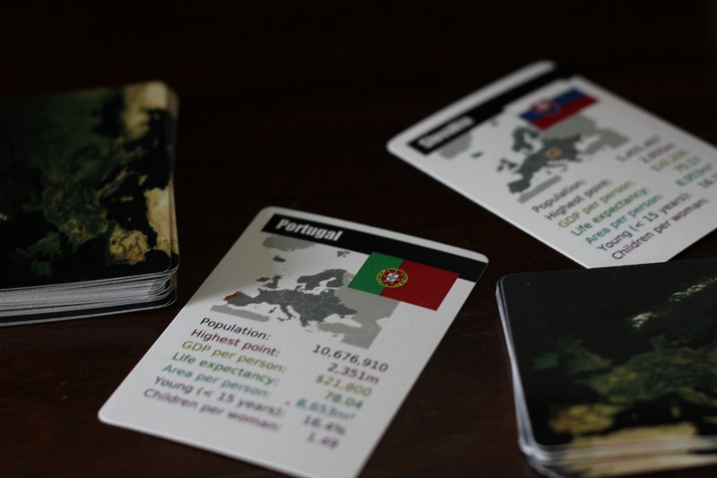

# EuroCards

(English description, see below)

Kortspil til brug i geografi-undervisningen.

Foreløbigt blot en prototype / proof-of-concept.

Tænker måske at søge tipsmidler til at lave en dansk udgave af dette, der dækker hele verden i stedet for blot Europa. Kontakt mig gerne hvis du vil være med til at lave en sådan ansøgning, eller vil spilteste det.

Spillet kan købes [online](https://www.thegamecrafter.com/games/EuroCards), eller ved at fange mig personligt (DKK 100).

## In English

EuroCards is a [Top Trumps](http://en.wikipedia.org/wiki/Top_Trumps) like geography game with cards with facts about the European countries.

You can buy it from [TheGameCrafter](https://www.thegamecrafter.com/games/EuroCards).

## Credits

- Data from CIA
- Satellite image from NASA

