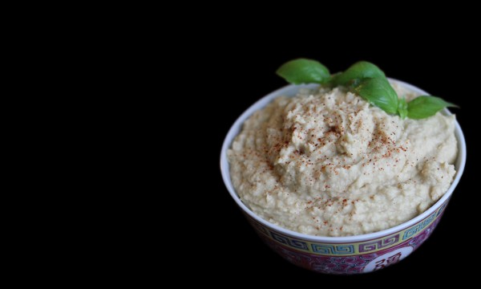

# Opskrift: Hummus

- 500g kogte kikærter
- ½dl vand
- Et lille hvidløg
- Saften af 3-4 citroner
- Et drys spidskommen
- En lille skefuld tahin

Ingredienserne blendes

Pynt:
- Et drys paprika
- Basilikum

----
Rasmus Erik, July 2012

