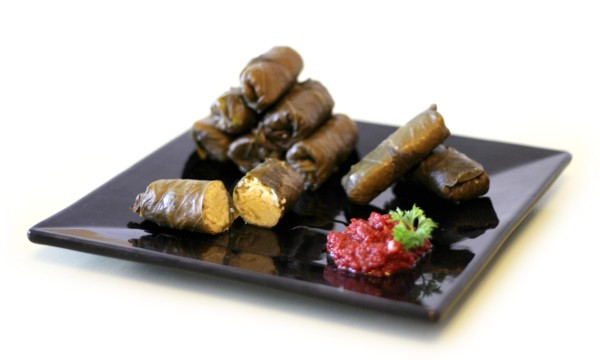

# Opskrift: Karry Dolmers

Ingredienser:

- 4 almindelige løg
- 1 rødløg
- smør til stegning
- karry
- 4 fed hvidløg
- ½kg basmatiris
- 400g vinblade i saltlage

Salsa:

- 1 lille hvidløg
- ½dl olivenolie
- 140g tomatkoncentrat

Karry og løg steges i smør, og herefter tilsættes risen.
Dolmers formes: Først nippes stilken af vinbladet, og derefter lægges en klump ris på bladet, siderne foldes op omkring risen og den rulles til en dolmer. Dolmerne pakkes derefter tæt i en gryde, og vand til kogning hældes derefter i gryden. Til sidst koges de en halv time - tre kvarter.

----
Rasmus Erik, July 2012

